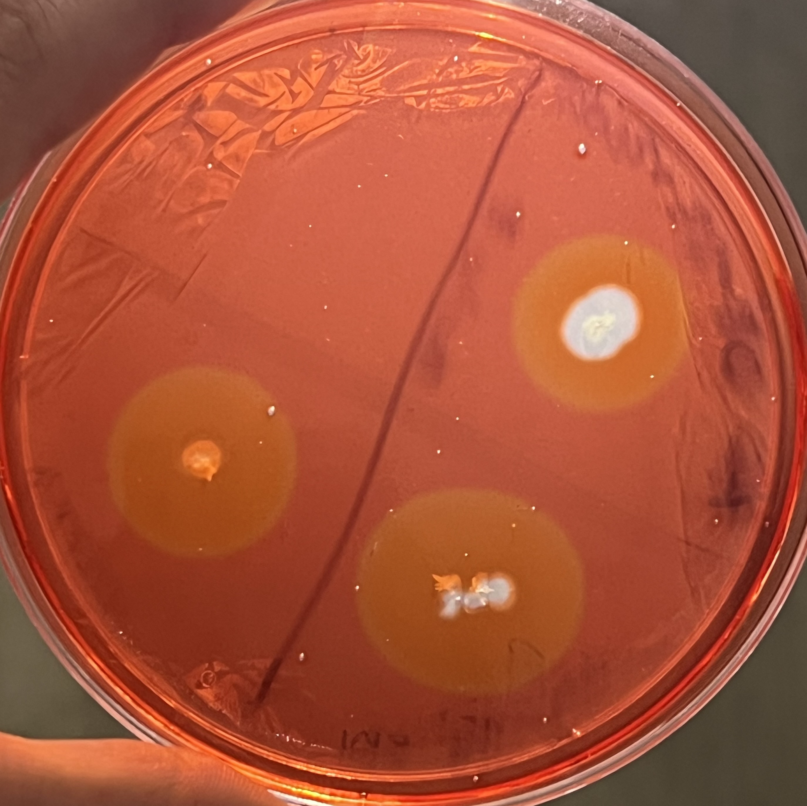

# 🧪Bitácora de laboratorio - Silvia M
# Medicina computacional
## 📌 Descripción
En este repositorio se estarán registrando las actividades del servicio social con el laboratorio de medicina computacional. Se incluirán ejercicios, pruebas de códigos, procesamiento y análisis de imágenes, además de herramientas utilizadas durante las prácticas.
La finalidad principal es documentar procedimientos, resultados y metodologías empleadas, facilitando la reproducibilidad y comprensión del trabajo realizado.
---
Hola, ¡bienvenidos!
---
## 👩‍🔬Presentación 
#### **Silvia Evangelina Mendez Varela, 22 años.**
* **Estudiante de la carrera Ingeniería Bioquímica en el Instituto Tecnológico de La Paz, actualmente cursando el 10mo semestre y realizando servicio social en medicina computacional.**
* **Como parte de mi formación académica y profesional he realizado estancia de verano científico en Bodegas de Santo Tomás durante 2 meses y actualmente me encuentro apoyando en prácticas de biología dentro del ITLP en el laboratorio de Bioquímica. Además, participé como expositora de cartel científico en el 3er simposio internacional de biotecnología sustentable con el tema "Aislamiento de bacterias y levaduras fermentadoras presentes en uvas de diferentes variedades de Bodegas de Santo Tomás y extracción de su DNA".**
Busco adquirir conocimiento en diversos campos relacionados con mi carrera, con la finalidad de contribuir a mi crecimiento académico y profesional🧬.
---
## 🎯Objetivo general
Implementar y aplicar técnicas computacionales para el procesamiento, análisis y visualización de datos, con el fin de consolidar el aprendizaje de metodologías científicas y contribuir al desarrollo de competencias analíticas en la interpretación de información obtenida en diversas prácticas experimentales. Además, adquirir conocimiento en diversos campos relacionados con mi carrera, con la finalidad de contribuir a mi crecimiento académico y profesional🧬.
## 🎯Objetivo servicio
### 💻🔬Espero que realizar el servicio social en el laboratorio de medicina computacional me permita integrar mis conocimientos en ingeniería bioquímica con herramientas computacionales, además de fortalecer las habilidades de investigación, pensamiento crítico y trabajo en equipo. 
🌱Me entusiasma desarrollarme en un área poco explorada dentro de mi entorno local, dado que representa una oportunidad para ampliar mis competencias y obtener un perfil profesional más integral.
---
## ⚙️ Requisitos
Para ejecutar este proyecto necesitas:
- Python 3.x
- pip o conda
- Librerías principales:
  - numpy
  - matplotlib
  - opencv-python
## 🧠Temas y técnicas trabajadas
* Procesamiento digital de imágenes
* Mejora de imágenes
* Segmentación de imágenes
* Análisis de datos
* Visualización de datos
* Manipulación de matrices 
---
## 🛠️ Herramientas utilizadas
- Python
- OpenCV
- NumPy
- Matplotlib
- Jupyter Notebook
- VS Code
---
## 🏥 Aplicación en medicina computacional
Las técnicas empleadas en este proyecto tienen aplicaciones directas en el área de la medicina computacional, particularmente en el análisis de imágenes médicas. Estas herramientas permiten mejorar la calidad de imágenes, resaltar estructuras de interés y facilitar procesos de segmentación, lo cual es útil en el diagnóstico, monitoreo y estudio de diversas condiciones clínicas.
---
## 📊 Resultados
Los resultados generados se almacenan en las carpetas de clase y tareas. Incluyen imágenes procesadas y análisis derivados de los experimentos.
---
## 📖Último proyecto
**Actividad celulolítica**

---
## 📧Contacto
#### Correos :)
**Correo personal:** silviamendezvarela@gmail.com

**Correo institucional:** L21310628@lapaz.tecnm.mx
---
**Fecha de inicio: 23 febrero del 2026**
**Duración: 480horas, máximo 500horas**
---
💻🔬💻🔬💻🔬
